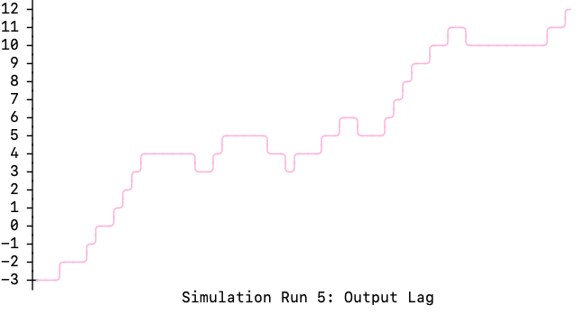

# The Goal Game Demonstration

As a IT consultant, have you ever wondered why agile projects seem to behave in exactly the same across different
organizations, teams, and Scrum masters? 
> Three sprints back we did 65% of our commitments. Two sprints back we did 104%. Last sprint we did 75%.
> I think we are getting predictable.

It has to do with the Scrum guide and how it is actually applied in the field. Turns out, if you
organise work in a specific way, you will get specific effects in the flow of work. And it also turns out 
there's an explanation for what you see in Scrum in the manufacturing world since 1970's. 

## A necessary throw-back

Alex Rogo, the protagonist in the novel 
["The Goal" by  Eliyahu M. Goldratt](https://en.wikipedia.org/wiki/The_Goal_(novel)),
is a managed of the loss-generating plant that the management intends to close down. Alex wants to prevent this 
from happening and is frantically looking to discover the reasons. And he happens to achieve this 
by playing a game using a box of matches and a die. 

If you struggle to understand why your Agile team is struggling to meet its commitments, if you want to understand
why your team's output oscillates, you need to play this game as well. Same as Alex Rogo.

In the novel, Alex Rogo replicates a production pipeline to "process matches" -- that is, to move them from box
to the output bowl. A match has to travel through 
several work centers "powered" by a boy scout. The number of matches a work center can move at each production
pipeline run in determined by a roll of the die.

This is an video illustration of the game The Goal novel describes.

[](https://youtu.be/RPZG8r_poZg)

In the book, Alex theorizes that the "production pipeline" he's setting up has a mean output of 3.5 matches
per cycle. So after 20 runs they should have "processed" 70 matches. Running this simulation several times
shows that such production line would produce around 50 "processed matches" after 20 cycles.

The Goal novel doesn't really visualize the data that Alex Rogo collects while playing this game.
This app fills this missing ga by visualizing the waves the inventory
moves through the plant (and a software development team). 

## A small theory

 The game illustrates a basic idea behind the Theory of Constraints and its application to practice:
- the bottleneck controls the output of the whole system; and
- all resources behind the bottleneck are always starved.

The game shows the inefficiency of a balanced production pipeline (or, by extension, a project team) and how they
lead to ever-increasing WIP (work-in-progress) build-up. A perfectly balanced
production pipeline is where the capacity of the pipeline perfectly matches the work is given to it.

The inefficiency arises from the very fact
that in the event a flow through the production line is upset out of balance, there isn't a possibility to
catch up.

In reality, a capacity of a work center on a production line fluctuate around its mean capacity: sometimes a work center does a little bit
above mean, sometimes below. Same for software engineers in an agile project working on features in the sprint.
These little oscillations have a dramatic impact on the output.

## Agile development extension

Building on the idea described in the book, this app provides modifications to this game that is tuned to the specifics of 
the software development projects. It simulates "epics", a pieces of related functionalities that need to be worked on
together, and it is slightly below the mean capacity. If a work center cannot complete the work on an "epic", the 
epic stays at the work center.

A practical example? Consider your work needs to be synchronized with e.g. an infrastructure release. Didn't make it in time? Let's
assume that you are affected by changing policies. Since you've missed to deliver, the work that you've done 
is no longer compliant and you need to rework. Although in reality it's unlikely that you will need to re-develop
everything, such situations can be quite disruptive for the flow of work.

## Running this app in container
You can run this container in container indicating desired plots to be produced.

### Expected vs achieved output
Let's look at the basic information Alex Rogo is after: how many matches will the pipeline be able to process?
```shell
docker run dlspwd2/the_goal_game:latest -plot-achieved-output
```
```shell
podman run docker.io/lspwd2/the_goal_game:latest -plot-achieved-output
```
> Hint: to re-run this simulation multiple times, add `-R` option specifying the desired number of 
> runs. To simulate the effects of receiving epics, add `-m epic-alternating` option. 


Re-running this simulation several times will give you different results. It's a probability game.

### Lag behind mean
The lag behind mean is how many "matches" are not processed relative to the pipeline's average. It oscillates, and
sometimes dramatically. You may want to run this simulation several times.

```shell
docker run dlspwd2/the_goal_game:latest -plot-lag -R 5
```
```shell
podman run docker.io/lspwd2/the_goal_game:latest -plot-lag -R 5
```


### Starving

The main reason for delays: a work center cannot use its capacity because inputs haven't reached it. Two 
options can be used: `-plot-starving` calculates the unused capacity percentage across all work centers.
`-plot-wrc-starving` shows actual unused capacity at the center.

```shell
docker run dlspwd2/the_goal_game:latest -plot-starving
docker run dlspwd2/the_goal_game:latest -plot-wrc-starving
```
```shell
podman run docker.io/lspwd2/the_goal_game:latest -plot-starving
podman run docker.io/lspwd2/the_goal_game:latest -plot-starving -plot-wrc-starving
```


### Inventory build-up

Accumulated WIP: a silent killer of any agility. This is the amount of work trapped within thin the pipeline.
It is not unusual to see work centers that accumulate 15 to 20 matches -- that is, 5 to 7 iteration worth of work
as their WIP. Guess what happens with due date and capacity to deliver the results?
> A hint: significantly delayed.

```shell
docker run dlspwd2/the_goal_game:latest -plot-wrc-inventories
```
```shell
podman run docker.io/lspwd2/the_goal_game:latest -plot-wrc-inventories
```


## Command Line Options

### Repeating options
- `-R` number of times to re-run the simulation (default to 1)

### Production line settings
- `-ps` production line size; default to `5`
- `-wrc-min` minimal capacity of a work center; default to `1`
- `-wrc-max` maximum capacity fo a work center; default to `6`
- `-c` number of cycles; default to `20` that are described in the book

### Match box behavior

- `-m`: feeding inventory option. The options are: `simple`, `epic-alternating`. Default to `simple`

In the book, Alex and scouts roll a die to determine the number of matches to draw from a box of matches.
This "match box" behaviour is modelled when `-m` option is set to `simple`. Here's the illustration:

| Cycle Number | Die Roll | Supplied |
| -------------| ---------| -------- |
| 1 | 2 | 2 individual matches |
| 2 | 5 | 5 individual matches |
| 3 | 1 | A single match |
| 4 | 2 | 2 individual matches |


The `epic-alternating`, as it's name implies, provides alternating "epic staff" for one cycle and set of individual
matches for another *regardless* of what the first work center in pipeline is capable of pulling (equal to the number
on the die).

There's the example using the pipeline described in the book with the mean capacity of the first work center of 3.5
and capability to draw determined by a throw of a die for the same results of a die roll.

| Cycle Number | Die Roll | Supplied |
| -------------| ---------| -------- |
| 1 | 2 | Epic with size 3 |
| 2 | 5 | 4 individual matches |
| 3 | 1 | Epic with size 3 |
| 4 | 2 | 4 individual matches |

This situation resembles closer a steady influx of work flowing into your average agile team from the stakeholders
with a complete disregard of how much work a team is able to take in and produce in the current iteration. This
situation is susceptible to producing bigger lags in delivery. 

> Don't be fooled by a coincidence. This is a game of chance. Probability can both favor and disfavour a particular
> simulation. The patter, though, remains.


### Output settings
- `-plot-achieved-output` plot achieved output vs mean output
- `-plot-lag` plot log of the output behind the mean output, the difference between two lines above
- `-plot-wrc-inventories` plot inventory size each work center has accumulated
- `-plot-wrc-starving` plot how much each work center starved (difference between how much a work center can
   do in this run vs inventory available)
- `-plot-starving` plot cumulative starving across all work centers
- `-G` plot all